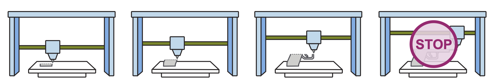

# An Adversarial Benchmark for Firearm Detection in 3D Printing

*A project by the [Columbia University Geometry and the City laboratory](https://gatc.cs.columbia.edu)*



This is a living, competitive benchmark for the detection of regulated firearm parts during 3D printing. See [here](docs/leaderboard.html) for the current leaderboard, [here](https://gatc.cs.columbia.edu/projects/detecting-regulated-firearm-components-in-3d-printing.html) for a layman-accessible summary of the results, or keep reading to understand how this repository works and how to contribute to it.

# How this benchmark works

This repository has the following three key elements:

- `detectors/`: These are methods that ingest a triangle mesh of a 3D shape and classify it as either "benign" (not a regulated firearm part) or "malign" (a regulated firearm part). See [Adding New Detectors](#adding-new-detectors) section below.
- `adversaries/`: These are procedural modifications of the regulated firearm shapes that attempt to evade detection by the detectors. See [Adding New Adversaries](#adding-new-adversaries) section below.
- `data/base-malign-shapes/`: A small dataset of regulated firearm shapes that the adversaries modify. So that you can develop your own methods and contribute to this project without access to regulated files, the repo instead ships dummy *proxy shapes* — not regulated, but sharing certain geometric properties with real firearm parts — in a separate `data/proxy-malign-shapes/` folder; the pipeline uses these automatically unless you populate `data/base-malign-shapes/` with the real shapes. When you submit a PR, we will train and evaluate your new functionality on our *real*, protected dataset, and report the real-data accuracy in the leaderboard. [Request access to the real dataset here](mailto:silviasellan@cs.columbia.edu).

## Running the benchmark

We have tested this using Python **3.13** only. Please start by installing all prerequisites in a virtual environment; for example, by running:

```bash
python3 -m venv .venv
source .venv/bin/activate
pip install -r requirements.txt
```

The benign half of the dataset is sampled from the [ABC CAD-model dataset](https://deep-geometry.github.io/abc-dataset/), which ships no pip package, so fetch it once with:
```bash
python load_data.py --download-abc
```
This downloads one ABC chunk (~6.5 GB) and extracts a pool of CAD meshes into `data/abc-pool/`. Set the `ABC_POOL_DIR` environment variable to extract them somewhere else (the meshes take tens of GB, so point it off any cloud-synced folder if needed). The other benign half (Thingi10K) is fetched automatically on first use.

Then, prepare the data by running 
```bash
python load_data.py
```
This will generate the full dataset, split into `train`, `test` (a validation split), and `eval` (held out) sets and laid out as `data/<split>/<class>/`.

Then, install all methods, train them and evaluate them with
```bash
python evaluate.py --install --train
```
and generate the leaderboard and precision-recall plots with
```bash
python generate_report.py
```


# Contributing

You can contribute to this adversarial benchmark in two ways: by playing the role of a detector, and adding a new method to classify shapes; or by playing the role of an adversary, and adding new modifications to the regulated shapes that attempts to evade detection. You can also play multiple roles at once; for example, by adding a new adversary that exposes an unknown vulnerability in the existing detectors, and then adding a new detector or modifying an existing one to catch it.

## Adding a new detector

In this modular repository, each detector lives in its own package under `detectors/`: create a new `detectors/<your_detector>/` directory and, inside it, an `__init__.py` and a `detector.py` file. This `detector.py` file must contain a new class subclassing `Detector` (defined in [`detectors/base.py`](detectors/base.py)):

```python
from .base import Detector

class YourDetector(Detector):
    ... your code here ...
```

The only real requirement of your detector is to implement the `eval` method, which takes a filepath to a .obj file and returns a confidence score between [0, 1] with 0 being benign and 1 being malign; for example,

```python
from .base import Detector
import gpytoolbox as gpy

class YourDetector(Detector):
    def eval(self, obj_path):
        # Read the mesh
        V, F = gpy.read_mesh(obj_path)
        # give it a random score, just for fun
        score = self.rng.uniform(0, 1)
        return score
```
Often, you will want to include more functionality in your detector. This can be done through the optional `train` and `install` methods; e.g.,
```python
from .base import Detector
import gpytoolbox as gpy

class YourDetector(Detector):
    def install(self):
        # do one-time setup (build native code, fetch model weights, etc.)
        # will be invoked once before training when you pass --install to evaluate.py, and is not repeated on later runs
        print("I am installing!")
        sleep(10)  # pretend installation takes 10s
        print("I am done installing!")

    def train(self, train, test=None):
        # train is a Split of .obj paths for the train split, test is a Split of .obj paths for the test (validation) split
        # This method will be invoked after installation, when you pass --train to evaluate.py
        print("I am training!")
        sleep(10)  # pretend training takes 10s
        print("I am done training!")

    def eval(self, obj_path):
        # Read the mesh
        V, F = gpy.read_mesh(obj_path)
        # give it a random score, just for fun
        score = self.rng.uniform(0, 1)
        return score

```
Your new detector may also want to save and load artifacts from training (e.g. model weights). These can be stored in `self.trained_dir`, which is mapped to the **gitignored** `detectors/<your_detector>/trained/` folder.

Your detector may also rely on committed reference data (e.g. reference shapes, lookup tables, etc.) that should be **tracked by git**; these can be stored in `self.data_dir`, which is mapped to the git-tracked `detectors/<your_detector>/data/` folder.

Once you've finished editing `detector.py`, re-export it from `detectors/<your_detector>/__init__.py`:
```python
from .detector import YourDetector
```
and register the class in the `DETECTORS` list at the top of [`evaluate.py`](evaluate.py):
```python
from detectors.your_detector import YourDetector
DETECTORS = [
    ...,
    YourDetector,
]
```
You can now test your new detector by running, for example,
```
python evaluate.py --install --train --detectors your_detector
```
where ommitting `--install` or `--train` will use the cached artifacts from the last time you ran with those flags. This allows you to quickly iterate on your detector's reporting without having to re-run every method.

## Adding a new adversary

The structure of adversaries mirrors that of detectors: each adversary lives in its own package under `adversaries/`: create a new `adversaries/<your_adversary>/` directory and, inside it, an `__init__.py` and an `adversary.py` file. This `adversary.py` file must contain a new class subclassing `Adversary` (defined in [`adversaries/base.py`](adversaries/base.py)), whose only requirement is to implement `__call__(self, vertices, faces, rng)`; for example,

```python
from .base import Adversary

class YourAdversary(Adversary):
    def __call__(self, vertices, faces, rng):
        # vertices is a (V, 3) numpy array of vertex positions, faces is a (F, 3) array of vertex indices, and rng is a seeded NumPy random number generator (please draw all randomness from it so the dataset stays reproducible from --seed)
        # grandom jitter
        V = vertices + rng.normal(scale=0.01, size=vertices.shape)
        F = faces
        return V, F
```
Then re-export it from `adversaries/<your_adversary>/__init__.py`:
```python
from .adversary import YourAdversary
```
and add it to `default_adversaries()` at the top of [`load_data.py`](load_data.py) as a `(name, adversary)` entry:
```python
from adversaries.your_adversary import YourAdversary
def default_adversaries():
    return [
        ...,
        ("your_adversary", YourAdversary()),
    ]
```